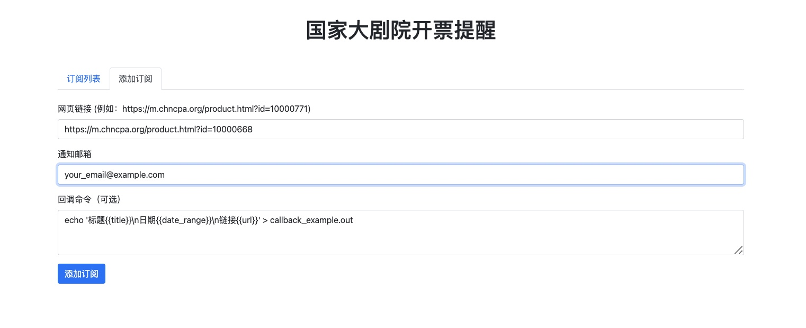

## 国家大剧院开票提醒

### 简介

> 本项目不是抢票脚本，仅仅是一个低频率的开票提醒服务。默认每个小时检查一下是否已经开票。

本项目旨在为国家大剧院的演出提供开票提醒服务。通过定时监测剧院官网，一旦发现符合预设条件的演出信息（如即将开票、立即购票等），就会触发邮件通知或自定义脚本。

### 使用方法

#### 1. **查看订阅列表**


列表中灰色的是已经开票的，彩色的是正在订阅开票时间的任务。

点击查看详情可以进入购票页面。点击小铃铛可以测试告警。点击❌可以取消订阅。

点击上次查询时间可以立即出发一次查询。

#### 2. **添加订阅**



在微信中搜索“国家大剧院”，或者直接点击 https://m.chncpa.org 进入官网。然后在购票日历中进入你想看的项目，选择右上角三个点，复制链接。

同时输入你的邮箱。即可在出票后1小时内收到邮件提醒。

### 配置

1. **复制配置文件:**
   将 `config.example.ini` 复制为 `config.ini`，并根据实际情况修改其中的配置项。
   * **SMTP 配置:**
     - `server`, `port`, `username`, `password`, `email`: 填写你的 SMTP 服务器信息。
     - **参考：** 对于 QQ 邮箱，可以参考 [https://wx.mail.qq.com/list/readtemplate?name=app_intro.html#/agreement/authorizationCode](https://wx.mail.qq.com/list/readtemplate?name=app_intro.html#/agreement/authorizationCode) 获取授权码。
   * **检查配置:**
     - `xpath`: 用于定位网页元素的 XPath 表达式。
     - `keywords`: 触发提醒的关键词。
     - `reverse`: 是否反向匹配（True 为反向匹配）。
     - `check`: 是否启用该检查项。
   * **回调配置:**
     - `code`: 自定义的触发脚本，可以使用 `{{title}}`, `{{date_range}}`, `{{url}}` 等变量。

### 使用

1. **运行项目:**
   
    ```python
   python app.py
   ```
2. **自定义提醒:**
   
   可以编写自定义的bash脚本进行 短信/微信 等更及时提醒。

### 工作原理

1. **定时检查:**
   程序会按照设定的时间间隔访问国家大剧院官网。
2. **匹配规则:**
   使用 XPath 和关键词对网页内容进行匹配。
3. **触发提醒:**
   一旦匹配成功，就会触发邮件通知或执行自定义脚本。

### 自定义

* **增加检查项:**
   你可以通过添加新的 `[check-*]` 配置节来增加更多的检查条件。
* **修改回调脚本:**
   你可以根据需求修改 `callback` 配置节中的脚本，实现更复杂的逻辑，比如发送短信、推送通知等。

### 注意事项

* **XPath 表达式:**
   XPath 表达式用于定位网页元素，需要根据剧院官网的 HTML 结构进行调整。
* **关键词:**
   关键词的选择直接影响提醒的准确性。
* **定时任务:**
   定时任务的频率需要根据实际需求进行调整，过于频繁的访问可能会对服务器造成压力。

### 示例配置文件 (config.ini)

```
[SMTP]
server = smtp.qq.com
port = 465
username = your_email@qq.com
password = your_auth_code
email = your_email@qq.com

[check-1]
xpath = //*[@id="comingSubmit"]
keywords = 即将开票
reverse = True
check = True

[check-2]
xpath = //*[@id="toSeatSubmit"]
keywords = 立即购票
reverse = False
check = True

[callback]
code = bash sms_sender.sh {{title}} {{date_range}} {{url}}
```

### 补充说明

* **sms_sender.sh:** 这个 Bash 脚本用于发送手机短信，你需要根据你的云服务实现这个脚本。
* **其他:** 
    - 可以将项目部署到云服务器上，实现更稳定的运行。
